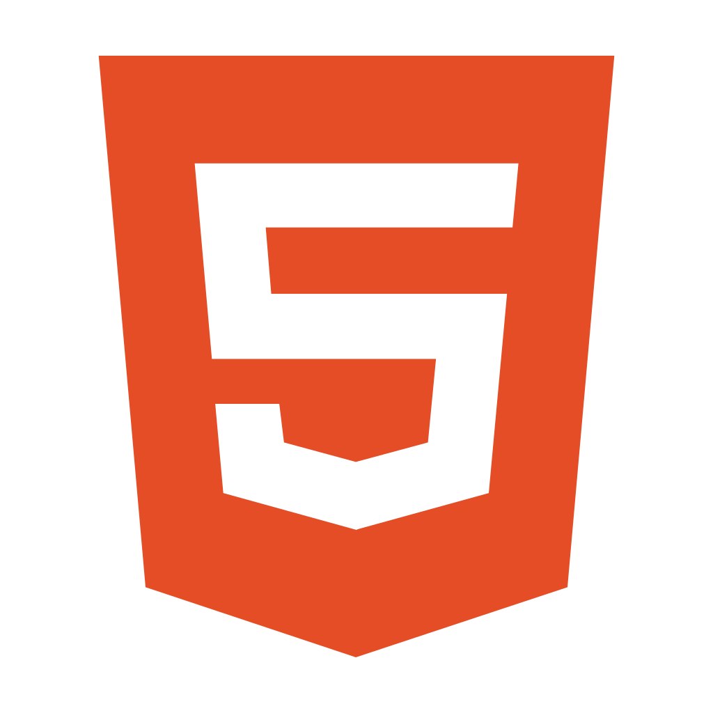
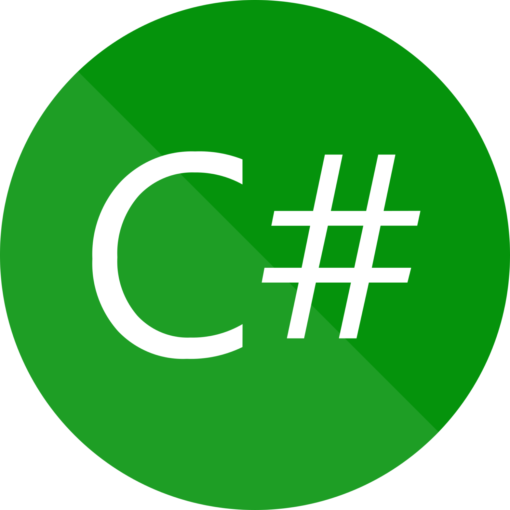
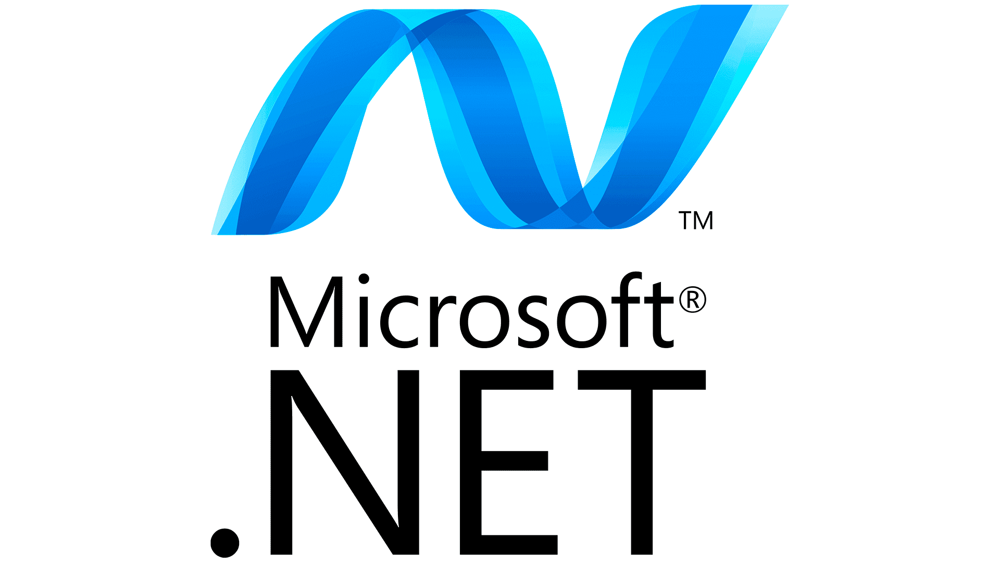
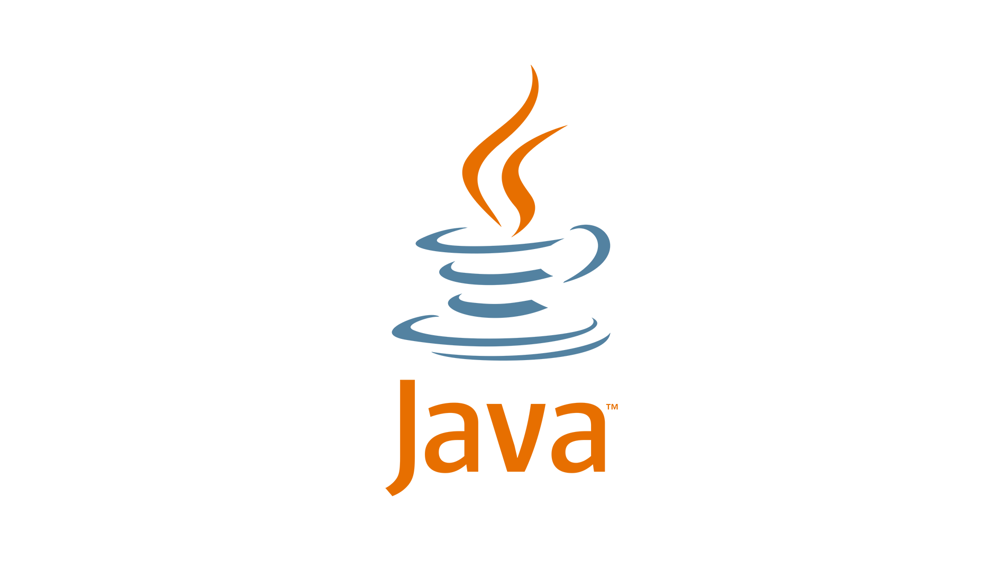
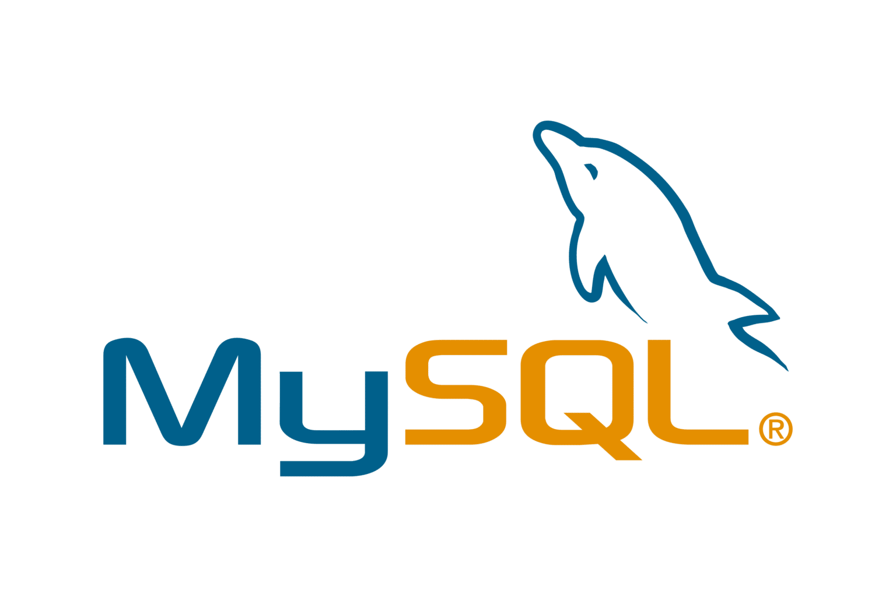
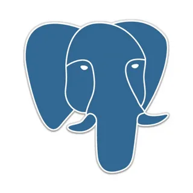
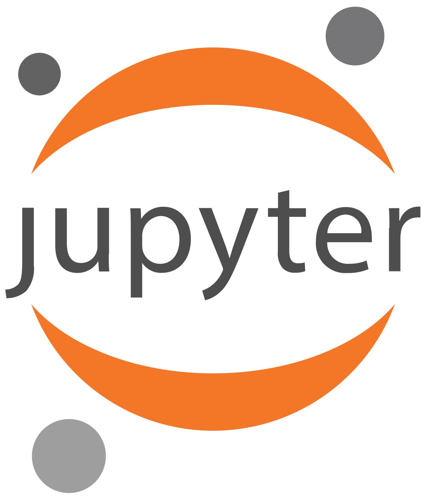

<h2 align="center">Hi, I'm Özlem KILIÇ. 👋</h2>
<h3 align="center"><strong>A forth-year Computer Engineering student at Yaşar University.</strong></h3>

- 🔭 I’m currently working on Developing my skills in both front-end and back-end areas. I enjoy learning and I am interested in keeping up with new technologies.
- 🌱 I’m currently learning Python and developing websites with ASP.NET CORE MVC.                    
- 🎮 Although I have gained many skills since I started my career, there are still many areas that I need to develop alongside the advancing technologies.
       Thanks to my passion for learning, I am becoming more specialized in various areas every day.                    
- 🎨 Whenever I have the opportunity, I also create visual designs in addition to software development.

## **Languages and Tools:**

 
 
 
 
 
 
 
 
 
 
 
  

 
 
 
 
 

## **Connect To Me**

<!--
**OzlemKlc/OzlemKlc** is a ✨ _special_ ✨ repository because its `README.md` (this file) appears on your GitHub profile.

Here are some ideas to get you started:

- 👯 I’m looking to collaborate on ...
- 🤔 I’m looking for help with ...
- 💬 Ask me about ...
- 📫 How to reach me: ...
- 😄 Pronouns: ...
- ⚡ Fun fact: ...
- 
-->

